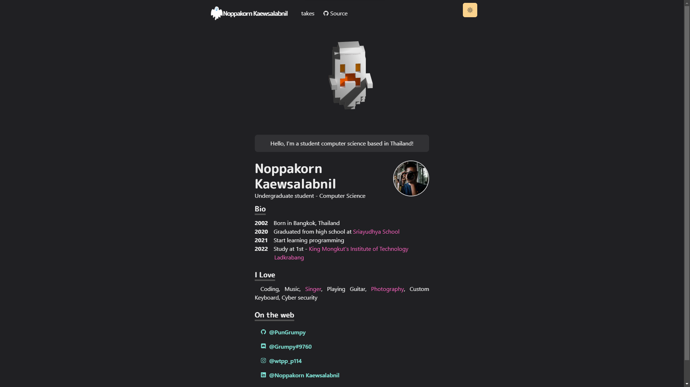

<!-- # Grumpy's Website -->
<div align="center">
    <h1><code>🐬</code> PunGrumpy's Personal Website</h1>
    <br />
    <p>
        <strong>My personal website built with Next.js, Chakra UI, Three.js and Framer Motion.</strong>
    </p>
    
    <br />
</div>

## `🐷` Stack

- [Next.js](https://nextjs.org/) - A React framework with hybrid static & server rendering, and route pre-fetching, etc.
- [Chakra UI](https://chakra-ui.com/) - A simple, modular and accessible component library for React
- [Three.js](https://threejs.org/) - 3D library for JavaScript
- [Framer Motion](https://www.framer.com/motion/) - An animation library for React

## `🐶` Development

### `🐱` Prerequisites

- [Node.js](https://nodejs.org/en/)
- [Bun](https://bun.sh)

### `🐭` Setup

```sh
# Clone the repository
git clone https://github.com/PunGrumpy/PunGrumpy-Website.git

# Navigate to the project root
cd PunGrumpy-Website

# Install dependencies
bun install
```

### `🐹` Development

```sh
# Start the development server
bun dev
```

### `🐰` Build

```sh
# Build the project
bun build
```

### `🐻` Serve

```sh
# Start the production server
bun start
```

## `🐼` Deployment

### `🐨` Vercel

```sh
# Deploy to Vercel
bun deploy
```

## `⚖️` License

This repository is licensed under the [MIT License](LICENSE).

## `🧑` Thank you

[Takuya Matsuyama](https://github.com/craftzdog) for [Takuya's Homepage](https://github.com/craftzdog/craftzdog-homepage)
